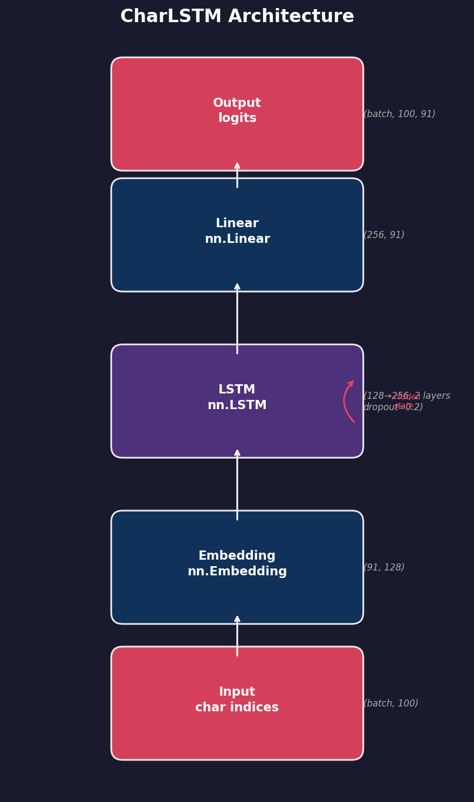
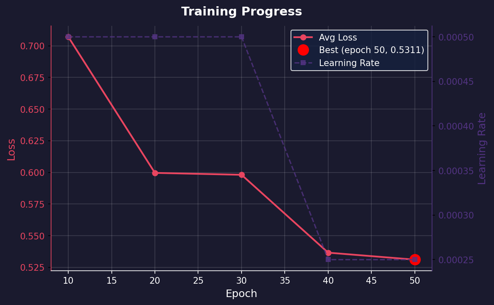

# Taylor Swift Lyrics Generator

A character-level LSTM that generates Taylor Swift-style lyrics, trained on her full discography (216 songs, 410K chars).

## How It Works

1. **Scrape** lyrics from Genius.com
2. **Preprocess** into character-level sequences (91-char vocabulary)
3. **Train** a 2-layer LSTM (embedding → LSTM → linear)
4. **Generate** new lyrics from a seed phrase using temperature-controlled sampling

## Quick Start

```bash
# Setup
python -m venv venv && source venv/bin/activate
pip install -r requirements.txt

# Scrape lyrics (not included in repo — runs against Genius.com)
python scrape_lyrics.py

# Train (takes ~30 min on Apple Silicon)
python train.py

# Generate
python generate.py                          # Interactive mode
python generate.py --seed "I remember"      # One-shot

# Web UI
pip install streamlit
streamlit run app.py
```

## Architecture



| Parameter | Value |
|-----------|-------|
| Architecture | CharLSTM (956K params) |
| Embedding dim | 128 |
| Hidden size | 256 |
| Layers | 2 |
| Dropout | 0.2 |
| Optimizer | Adam (lr=0.001) |
| Scheduler | ReduceLROnPlateau (patience=3, factor=0.5) |
| Epochs | 50 |
| Best loss | ~0.53 |

## Training



## Project Structure

```
├── scrape_lyrics.py   # Genius.com scraper
├── preprocess.py      # LyricsDataset (sliding window sequences)
├── model.py           # CharLSTM definition
├── train.py           # Training loop
├── generate.py        # CLI inference
├── app.py             # Streamlit web UI
├── visualize.ipynb    # Architecture & training curve plots
├── data/              # Lyrics corpus (generated by scraper, not in repo)
├── model/             # Exported diagrams for README
└── checkpoints/       # Saved models + vocab (not in repo)
```

## Sample Output

**Current output** (baseline model, 50 epochs):
```
Seed: "I remember when"   Temperature: 0.8

I remember when my see someren up my mared or some day
Cut see me so pushs good somering ausuved and you do
You stand ul may name along it all never see me a quecess ou puts me me somethin'
The more some single there's making my post girs are push some home
```

The model picks up line structure, rhyme-like endings, and Taylor-ish phrasing — but there's plenty of room to improve. With a larger dataset, more training, or architectural tweaks, an improved version could produce output like:

```
I remember when we were sitting on the stairs
and you told me that you loved me
but I was too afraid to say it back
so I watched you drive away...
```

> Lower temperature (0.2–0.5) = more repetitive but structured. Higher (0.8–1.5) = more varied but noisier.
